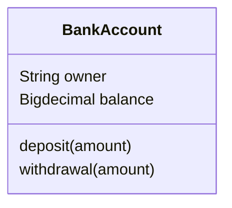
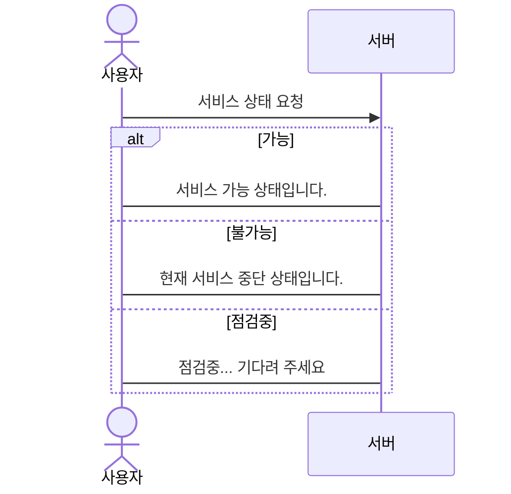
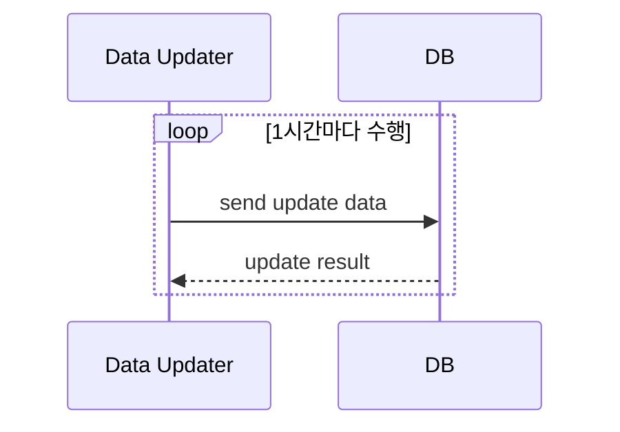
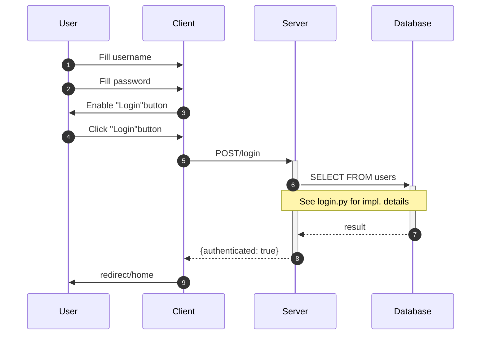

# Mermaid 실습
- 순서도 실습
    - 첫번째 샘플


```{mermaid}
classDiagram
direction BT %% TB, BT, RL, LR 모두 가능

    class Person{
        <<abstract>>
        +name: str
        +phoneNumber: str
        +emailAddress: str
        +purchaseParkingPass()
    }

    class Student{
        
        +studentNumber: int
        +averageMark: int
        +isEligibleToEnroll(str) bool
        +getSeminarsTaken(): int
    }

    class Professor{
        -salary: int
        #staffNumber: int
        -yearsOfService: int
        +numberOfService: int
    }
    class Address{
        +street: str
        +city: str
        +state; str
        +postalCode: int
        +country: str
        -vaildate() bool
        +outputAsLable() str
    }

    Person <|-- Student
    Person <|-- Professor
    Student "0..*"<--"1..5" Professor : supervise
    Person "0..1"-->"1" Address : lives in
```










## 여기는  수업 끝 입니다.